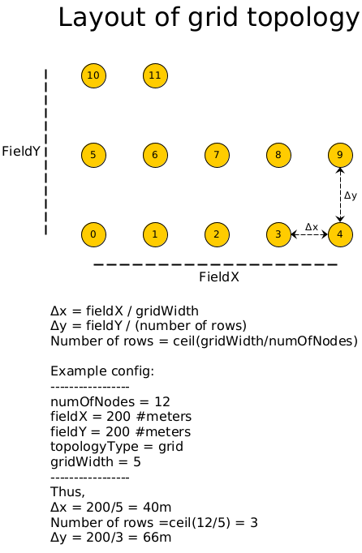

## Whitefield Configuration User Manual

Whitefield configuration provides common configuration options across different airlines and stacklines used 
i.e. the same configuration works whether you use NS3 or Castalia-Omnet++ as Airline or use Contiki/RIOT as 
stackline.

|Key|Value Range|Remarks|
|---|-----------|-------|
|numOfNodes|[2-5000]|Number of nodes in the network|
|fieldX|Uint range|Field length in X direction ... Currently only 2D model is supp|
|fieldY|Uint range|Field length in Y direction|
|topologyType|randrect|Randomly place nodes in area denoted by fieldX * fieldY|
| |grid | Grid topology where nodes are separated by distance specified by fieldX * fieldY and the width of the grid is specified by gridWidth|
|gridWidth| Uint range | Width of the grid. Only applicable when topologyType=grid |
|nodePosition[*]|10,20,0|Manually position the node at the given location specified by x,y,z coordinates|
|nodePromiscuous[*]|1|Set promiscuous mode for the node. Node will receive not only broadcast or unicast packets destined to it but also other packets not destined to it but the node is in receive range.|
|panID|Ushort range| PAN identifier to be used in LOWPAN |
|macPktQlen|<100|Maximum number of packets that can be buffered/queued at MAC layer|
|macMaxRetry| <20 | Maximum number of times the mac packet will be retried |
|nodeExec[*]|/path/to/stackline.bin| Native compiled executable path for Contiki/RIOT nodes will be specified here|
|captureFile[*]|/path/to/pcap_dir|Location where pcap will be stored ... Not supported currently, use NS3_captureFile instead|
|NS3_captureFile|/path/to/pcap_dir|Uses NS3's inbuilt pcap capturing method |

The configuration can be applied to only a set of nodes (for configuration options specified with [*]) by specifying the node index range (note, the first node has an index of zero). 
For e.g.
```
numOfNodes=20
nodeExec=/path/to/contiki
nodeExec[5]=/path/to/scapy
nodeExec[10-19]=/path/to/riot
```
In the above configuration the first nodeExec=/path/to/contiki will result in the execuatable getting set for all nodes. 
In the subsequent config statement, nodes[10-19] (inclusive) will override the nodeExec path. 
Note that the sequence of configuration option is important in this particular case.

### Sample layout for Grid topology


