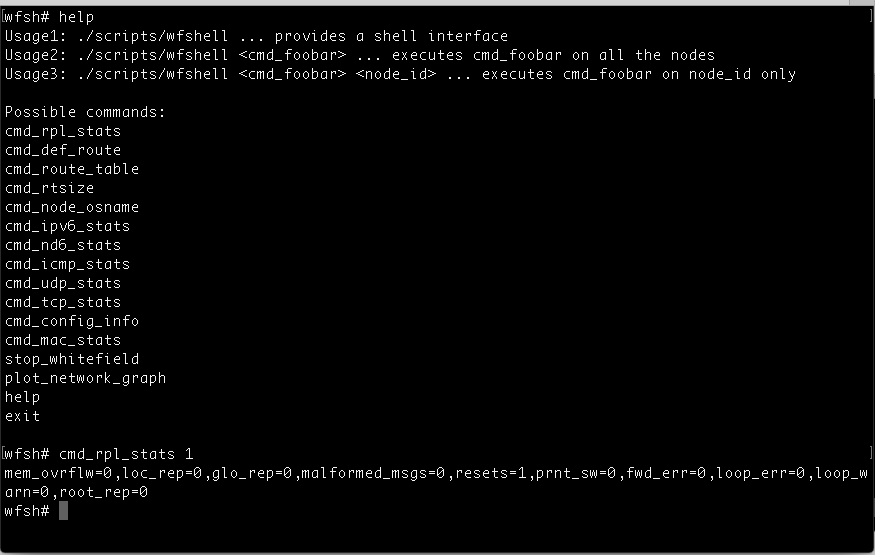
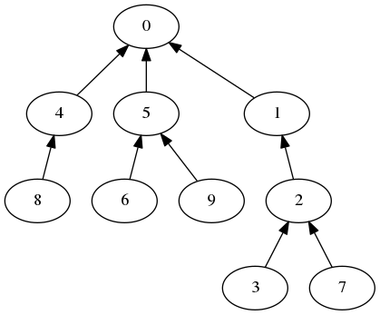
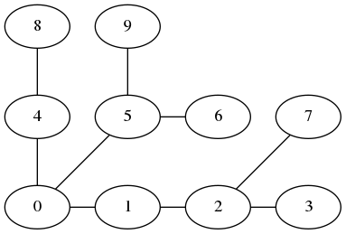

# OAM/Monitor command help

Primary aim is to provide a common OAM across use of any stackline or any airline. For e.g. the same set of commands should work for Contiki or RIOT, similarly for Airline OAM (such as for MAC statistics) be it NS3 or Castalia.

The debug logs/errors of every node is redirected to a file in whitefield/log folder. Similarly the pcap format packet capture be enabled for all nodes (the default path for pcap is whitefield/pcap).

Debugging a Contiki node: Enable the DEBUG_PRINT option for the relevant module and the stdout prints will be redirected to the log/node_XXXX.log file where XXXX is the node id.

## Monitoring Whitefield

```
whitefield$ ./scripts/monitor.sh
```


## wfshell

```
whitefield$ ./scripts/wfshell
```


## Network graph plot

Sample Config:

```
numOfNodes=10
fieldX=300  #field space in x direction ... currently 2D model is supp only.
fieldY=300  #field space in y direction
topologyType=grid   #grid, randrect (ns3 RandomRectanglePositionAllocator), 
gridWidth=4  #Grid topology width if the topologyType=grid
```
```
whitefield$ ./script/wfshell plot_network_graph tree.png pos.png
```
Tree-like plot:



Position based plot:


